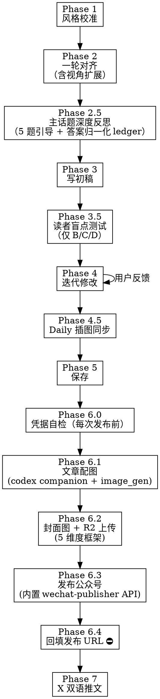

# 自媒体内容创作

从日志素材到多平台发布（公众号 + X 双语）的端到端工作流。

## 核心原则

- **像人写的，不像 AI 写的**：避免格式化、模版化、说教感。参照作者真实风格，不是"优质文章模板"
- **风格档案驱动**：每次写作前校准风格，持续吸收新文章
- **一轮对齐，快速出稿**：不反复确认，不生成设计文档，不做任务追踪
- **作者有最终决定权**：AI 出初稿，作者改方向
- **英文单词不可断行**：文章中出现的英文单词、人名、产品名必须保持完整，不能因为换行导致单词被拆开。尤其是发布到公众号时，排版引擎可能在任意位置断行，所以英文前后应留出自然断点（如标点、空格），避免出现 "Nav\nal" 这类拆词
- **复盘融入式写作**：日常写作 = 一次深度反思的产出。Phase 2.5 引导作者对主话题深度思考，Phase 3 把答案以作者语气融入文章——不做作、不填表、不写问答体。Mode A 日记体 + 反思是一等输出，不强行往 B/D 推
- **凭据零接触**：AI 永不读、永不写 `~/.jdy_writer/.env`；用户在终端自己用 `nano` 写。任何 secret 出现在对话 = 立即视为泄露，要求 jdy 重置（详见 Phase 6.0）
- **自包含工具链**：图片生成走 codex companion + 内置 image_gen；公众号发布走 jdy_writer 内置的 `wechat-publisher/`。**不依赖 baoyu-skills、jdy-imagine 等外部 skill**（已在 2026-05-07 重构内化）

## 流程



---

## Phase 1: 风格校准（自动，无需用户参与）

### 1.1 加载风格档案

读取技能目录下的风格档案 `writing-style-profile.md`（与 SKILL.md 同目录）。

如果文件不存在，执行完整风格分析（见 1.3）。

### 1.2 增量吸收新文章

每次调用时，检查是否有新的公众号文章尚未被分析：

```bash
# 获取所有公众号文章，按文件名排序（YYYYMMDD 开头，即时间顺序）
find 60_Output/公众号/ -name "*.md" -not -path "*/attachments/*" -not -path "*/illustrations/*" -not -path "*/prompts/*" -not -name "*-publish.md" | sort

# 与风格档案中的 last_analyzed_file 对比，排在其后的即为新文章
```

**判断是否有新文章**：
- 风格档案中维护 `last_analyzed_file`（最后分析的文件名，如 `20260322 标题.md`）
- `find | sort` 获取全部文章列表，排在 `last_analyzed_file` 之后的即为新文章
- 文件名以 `YYYYMMDD` 开头，按名称排序即为时间顺序，不依赖文件修改时间

**如果有新文章**：
1. 仅读取排在 `last_analyzed_file` 之后的文章
2. 分析是否有风格变化（新的话题类型、语气转变、新的常用词汇）
3. 更新 `writing-style-profile.md`（追加新发现，修正过时描述）
4. 更新档案中的 `last_analyzed_file` 为最新文件名

**如果没有新文章**：直接使用现有档案。

### 1.3 首次完整分析（仅风格档案不存在时）

**用户提示**：首次分析前输出一句提示——"首次校准风格档案，正在分析 N 篇历史文章..."（N 为实际文章数）。

用 subagent 并行阅读所有历史文章，归纳：
- 4 种风格模式（日记体/深度思考/框架教程/长叙事）
- 通用特征（语言、结构、开头结尾模式）
- 高频词汇/黑话
- 写作检查清单

保存到 `writing-style-profile.md`。

---

## Phase 2: 一轮对齐（1 次交互）

### 2.1 读取素材

- 如果用户指定了日期，读取该日期的 daily log（`50_Daily/YYYY/MM/YYYY-MM-DD.md`）
- 如果用户未指定日期，自动获取 `50_Daily/` 中最新日期的文件：
  ```bash
  find 50_Daily/ -name "*.md" -not -path "*/attachments/*" | sort | tail -1
  ```
- 如果日志不存在，提示用户口述今天的内容
- 读取日志中提到的关联文章（前序叙事连续性）

### 2.2 一次性输出，用户一次性确认

在一条消息中输出以下所有内容，用户一次性回复确认或调整：

```
## 素材与推荐

**候选话题：**
| # | 话题 | 类型 | 推荐 |
|---|------|------|------|
| 1 | xxx | 市场 | ★★★ |
| 2 | yyy | 生活 | ★★☆ |
| ... | | | |

**视角扩展：**
| # | 人物 | 切入角度 | 来源 |
|---|------|---------|------|
| 1 | [真实人物名] | [该人物哪个观点与素材相关] | [具体书名/文章] |
| 2 | [真实人物名] | [切入角度] | [来源] |
| 3 | 不需要外部视角 | 用自己的经历和判断 | — |

**推荐方案：**
- 主话题：[# + 简述]（指向上方候选话题表中的某一行 #；按下方主话题选择 rubric 决定）
- 风格：[模式名]（[简述理由]）
- 板块：[N] 个（[话题1] + [话题2] + ...）
- 深度技法：[翻转常识/画面收束/一句刺穿/不使用]（[简述为什么这个素材适合这个技法]）
- 影响力手法（仅 Mode B/D）：[方法论包装/传播锚点/具名感恩/不使用]（[简述理由]）

**标题候选（5 个，覆盖不同标题机制和读者入口）：**

| # | 标题 | 机制 | 源素材 | 反例对照 |
|---|------|------|--------|---------|
| 1 | xxx | 状态标签 / 场景反差 / 概念判断 / 口语碎片 | [原文短句/明确场景/可定位事实] | 避开 X：Y |
| 2 | yyy | ... | ... | ... |
| 3 | zzz | ... | ... | ... |
| 4 | aaa | ... | ... | ... |
| 5 | bbb | ... | ... | ... |

标题规则：

**核心原则：标题里要有"人的状态"或"作者的判断"，不能只有"事"。**

**4 种机制（按素材类型选，不强求每篇都覆盖全部）：**

| 机制 | 适用素材 | 形式 | 好例子 | 差例子 |
|------|---------|------|--------|--------|
| 状态标签 | 日记体、情绪低/忙、生活碎片 | 2-6 字状态/判断/动作 | 忙碌 / 两难 / 修心 / 了却心事 | 加油 / 周末（无素材锚点的抽象词） |
| 场景反差 | 有反转/出乎意料/对比 | 两个画面或时刻并置，情绪落差自现 | 不想出门的早上，不想回家的下午 / 顶风出门，海边没风，心里有风 | 取消行程后的意外收获（这是摘要） |
| 概念判断 | AI/Web3/工具/方法论文章 | 概念 + 作者的判断/隐喻/反差 | Markdown：AI 世界的原住民 / AI 平权，从未发生 / 大模型：把时间压进空间 | Markdown 使用指南（中性解释） |
| 口语碎片 | 情绪浓但事件简单、家庭日记 | 像从对话/内心独白截出来的半句 | 又梦到老家了 / 他不是傻 / 夜谈 | 清明思乡（抽象大词无场景） |

**长度：2-24 字之间，按机制定**——状态标签和口语碎片可短到 2-4 字；场景反差通常 8-18 字；概念判断可到 24 字（含冒号/逗号）。**禁止一刀切 8-18 字。**

**机制选择决策：**
- 素材是 AI/Web3/工具知识 → 至少 1 个候选用「概念判断」
- 素材是日记/家庭/生活 → 至少 1 个候选用「状态标签」或「口语碎片」
- 素材有反转/对比 → 至少 1 个候选用「场景反差」
- 同一机制 ≤ 2 个
- **5 个候选不能只是同一意思的换皮；每个候选必须切入不同的状态、判断或场景**（即使机制相同也要切入不同）

**身份处境（可选维度，不强制）：**
如果素材天然指向一类人（独立开发者/带娃父母/做市商等），标题可以带出身份处境（如"独立开发者的两难"），但不要为了覆盖维度硬造身份。

**源素材列（强制写，要求严格）：**
必须是原文短句、明确场景或可定位事实——不能写"文章表达了焦虑感"这种抽象概括。如果"源素材"写不出具体短句/场景/事实，删掉这个候选。

**反例对照列（强制写，短句格式）：**
每个候选必须在表格"反例对照"列写"避开 X：Y"：
- 避开事件摘要：取消行程后的意外收获
- 避开抽象大词：清明思乡
- 避开营销号：普通人一定要知道的 AI 机会
- 避开中性报告：项目进展记录

如果写不出反例对照，删掉这个候选。

**增强手段（可叠加）：** 同词反复制造节奏（"不想...不想..."）；具体数字 > 模糊表述；口语 > 书面语

**禁区：**
- 营销号套路（"震惊""99%的人不知道""底层逻辑""认知升级"）
- 抽象大词（"红利""时代""普通人"——除非文章本身真接得住）
- 完整叙事句（"我取消了行程反而遇到了最好的一天"——这是摘要不是标题）
- 无素材锚点的抽象词（"退潮""礁石"——短标题可以成立，但必须是人的状态、作者判断，或被文中具体场景钉住）
- 标题必须与内容一致——"用夸张的方式说真话"

→ 回复示例：「话题 1,2 / 视角 1 / 标题 2」或直接「确认」接受全部推荐
```

**不要逐板块确认，不要逐个问题提问。** 一次给完，一次确认。

### 2.2.2 主话题选择 rubric（确定性规则，AI 必须按此选）

候选话题按下列 5 维度评分（每维 0-2 分，0 = 无、1 = 中、2 = 强）：

1. **后果性 (Consequence)**：这件事的结果是否有真实代价/收益？
2. **新颖性 (Novelty)**：是不是没经历过的新情况？
3. **情绪密度 (Emotional Charge)**：作者写时是否有强情绪（紧张/沮丧/兴奋）？
4. **决策密度 (Decision Density)**：当下是否做了多个判断？
5. **读者价值 (Reader Value)**：这件事对读者是否有可带走的判断？

**margin 规则**（防止 AI 在评分相近候选间随便选）：

- 总分最高的话题 - 第二名 ≥ 3 分 → 选为主话题，进入 Phase 2.5
- 差 ≤ 2 分（无显著主话题）→ 不强选；Phase 2.5 例外触发：跳过 5 题引导，直接进 Phase 3 用 Mode A 速记型

**同一天写第二篇文章**：第二篇的主话题候选必须**排除上一篇已发表文章的主话题**——以"上一篇 saved md 文件中 Phase 2 的主话题文本（normalized topic label，例如『OPN 跌破 0.4』）"为排除键，**不依赖候选表行号 #**（# 在不同篇之间不稳定）。然后按 rubric 重选。

注：本 rubric 是主话题判定的**唯一真源**——Phase 2.5 触发条件、边界情况、验证场景全部以本节为准。

### 2.2.3 Phase 2.5 与 Mode 的关系（不自动翻 Mode）

**核心原则**：Phase 2.5 答案是**写作素材**，不是改变 Phase 2 已确认 Mode 的依据。Phase 2 推荐的 Mode 在 Phase 2.5 之后**保持不变**——保护 Phase 2 已配套的 title / depth 技法 / 影响力手法不会失效。

**Mode A + 反思是一等输出**：

- 风格档案明确日记体已有"主话题甩一句判断"模式（参见档案第七章「日记体的暗线」第 2 条）
- 当 Phase 2 推荐 Mode A 时，Phase 2.5 答案的归一化 ledger 自然落入：
  - "已想清楚的判断" → 主话题段落第一句的判断（一句刺穿）
  - "仍未想清楚的点" → 主话题段落里的"反思:" 句
  - "可入文的金句" → 主话题段落或全文结尾
- 不需要翻 B/D，Mode A 也能承载完整反思

**作者主动改 Mode 的入口**：作者看完归一化 ledger 后，**可以**主动说"这个素材太厚 Mode A 装不下，换 Mode B"——此时回到 Phase 2 重新生成 title / 深度技法 / 影响力手法（明确的回退步骤，而不是 AI 偷偷翻）。

### 2.2.1 风格协商（用户提出非推荐风格时）

用户可能要求 skill 未预设的风格（如议论文、政策评论、书评等）。处理规则：

1. **诚实评估**：对照风格档案，说明该风格与作者历史文章的差距（如"64 篇文章没有一篇脱离个人经历的纯评论体"）
2. **提供折中方案**：用作者的声音承载用户想要的深度。例如"用你的声音写 Mode B 深度思考"——从个人经历出发推到更大判断，而不是写成第三方评论
3. **补充素材**：折中方案通常需要更多素材支撑深度。主动提出 2-3 个定位问题帮用户展开想法
4. **不拒绝，引导**：用户有最终决定权，但 AI 有责任指出风格偏移的风险

### 2.3 视角扩展规则

**推荐要求**：
- 必须是真实的作家/思想家/从业者，不用泛化角色（"Nassim Taleb" 而非 "风险管理专家"）
- **领域匹配**：推荐人物必须贴着素材所在的领域/行业，而非总是推荐通用思想家。写 DeFi 踩坑推 DeFi 领域的人，写育儿推教育领域的人，写投资推投资领域的人
- 推荐理由要具体到该人物的哪个观点/哪本书/哪篇文章与素材相关
- 最后一个选项始终是「不需要外部视角，用自己的经验就够」
- 如果对推荐的人物不够了解，先联网搜索再推荐

**用户指定未知人物时**：
1. 联网搜索该人的核心观点、代表作品、写作/思维风格
2. 用 1-2 句话复述理解，请用户确认
3. 确认后再进入 Phase 3

### 2.4 融合深度（自动选择，传递给 Phase 3）

用户选定视角后，根据素材与视角的关系自动选择融合方式，不需要询问用户：

| 融合方式 | 适用场景 | 示例 |
|---------|---------|------|
| **借思路** | 素材本身有完整经历，只需要一个更锐利的分析角度 | 用 Taleb 的"脆弱性"框架来分析自己踩坑的经历，但全程自己的话 |
| **对话式** | 素材中的观点与该人物观点有张力或互补 | "Munger 说要在能力圈内投资，但我今天做的事恰好在圈外——" |
| **显式引用** | 该人物有一句广为人知的话能精准命中文章主题 | "塔勒布说过：'风平浪静的时候，没人记得救生艇在哪。'今天的行情就是这句话的注脚。" |

**选择逻辑**：
- 素材中有亲身经历 + 认知转变 → 借思路（最常用）
- 素材观点与人物观点形成对比/冲突 → 对话式
- 人物有一句话能一击命中主题 → 显式引用
- 同一篇文章中不同板块可以用不同融合方式

---

## Phase 2.5: 主话题深度反思（自动触发）

Phase 2 用户确认推荐方案后，**自动**进入本阶段。引导作者对当天选定的主话题做深度反思；答案以"自然、贴合语气、不做作"的方式融入 Phase 3 的文章。

### 2.5.1 触发条件

按 Section 2.2.2 主话题选择 rubric 判定：

- 主话题显著（top 总分 - 第二名 ≥ 3 分）→ 触发本阶段，进入 2.5.2
- **例外**（top - 第二名 ≤ 2 分，无显著主话题）→ 跳过本阶段全部题（不论 N=0/1/2），直接进入 Phase 3，Mode A 速记型

注：本判断只看主话题显著性，不预先按 Mode 区分（Mode A/B/C/D 均可触发）。

### 2.5.2 提问结构

5 个问题一次性给出，作者按需回答（可逐题答、可一次性答、可跳过）。

**核心 3 问（每次固定）**：

1. **当时的真实判断 vs 现在回看**：你在做这件事的当下，真实的想法是什么？现在回头看还成立吗？
2. **是否模式重犯**：这是孤立事件，还是某类问题的第几次？如果是重犯，前几次的教训为什么没生效？
3. **3 个月后回看，今天最该改的是什么**：把今天放到时间线上，未来某个回头看的时间点（3 个月/半年），最该改的一个动作是什么？

**临场补充 1-2 问（AI 基于主话题动态生成，N ∈ [0, 2]）**：

约束：
- 必须基于 Phase 2 选定的主话题内容（不脱离上下文）
- 必须比核心 3 问更具体（追问"哪条假设破了"而非"反思一下"）
- 不超过 2 题（5 题已是上限）
- 必须从下方"问题家族菜单"中选 1-2 个家族，每个家族出 1 题（不允许自由发挥造问题）

#### 问题家族菜单（防止长期质量漂移）

AI 临场题必须从这 6 个家族中选取，根据主话题内容匹配：

| 家族 | 触发条件 | 提问模板 |
|------|---------|---------|
| **Broken Assumption（假设破了）** | 主话题涉及决策/判断 | "你做这件事时的核心假设是 X，现在 X 还成立吗？哪一条最先破？" |
| **Repeated Mistake（重犯模式）** | 主话题与过往踩坑相似 | "上次你在类似情况下做了 Y，结果是 Z；这次为什么觉得不一样？" |
| **Hidden Incentive（隐性诱因）** | 决策受群体/权威/情绪驱动 | "如果不是 P 总/X 群/今天 fomo 推着，你今天还会做这件事吗？" |
| **Opportunity Cost（机会成本）** | 主话题是 action 或 inaction | "做这件事的代价是没做 W，W 的预期回报是多少？" |
| **Evidence Threshold（证据门槛）** | 判断基于弱信号 | "你下这个判断时有哪几条具体证据？最弱的那条还经得起追问吗？" |
| **Identity Trap（身份陷阱）** | "我是 X 类人"影响判断 | "如果你不是程序员/Web3 散户/jdy，今天这件事你会怎么做？" |

AI 必须**先识别主话题最匹配哪 1-2 个家族**，再从家族模板生成具体问题。家族不够覆盖的主话题，省略临场题（N=0），只问核心 3 问。

### 2.5.3 不允许的提问类型

- ❌ 万能问题（"这件事让你学到了什么"——太宽）
- ❌ 鸡汤问题（"你最骄傲的时刻是什么"）
- ❌ 心理分析（"你为什么这么焦虑"——风格档案禁止心理分析）

### 2.5.4 答案处理与跳过机制

设实际提问总数 T = 3 + N（核心 3 + 临场 N，N ∈ [0, 2]，由 2.5.2 决定）。「答案数 A」= 作者实质回答的题数（不含明示"跳过/不知道"和极短无内容回应如"嗯"）。「跳过数 = T - A」。判定时机为 Phase 2.5 结束、进入 Phase 3 前。

判定规则**按答案数 A 划分（与 T 解耦）**：

| 答案数 A | 处理 |
|---------|------|
| **A ≥ 2** | 进入 2.5.6 答案归一化，再进入 Phase 3 |
| **A = 1** | 提示作者：「今天主话题深度不够，可改用 Mode A 日记体直接写（不强制）。是否切换？」**作者确认 → 回到 Phase 2 显式重生 title / 深度技法 / 影响力手法（保持 2.2.3"不偷偷翻 Mode"原则），再进入 2.5.6 / Phase 3**；不确认 → 用现有 Mode + 这 1 条答案进 2.5.6 归一化后写作 |
| **A = 0**（全部跳过） | 直接进入 Phase 3，按 Phase 2 推荐方案写作（**0-answer path 不经 2.5.6**——2.5.6 仅在 A ≥ 1 时才是 Phase 3 唯一输入源；见 2.5.6 末段语义补充） |

**答案存储**：仅保存在对话 context 中，不另存为文件。

**为什么按 A 不按"跳过题数"**：T 在不同篇之间会变（N=0/1/2），固定阈值（如"≤2 跳"）会让 N=0 时"3 题全跳"误入"≤2 跳"的正常分支。按 A 判定与 T 解耦，三种 N 下行为一致。

**作者中途想退出 Phase 2.5**：任意时点说"跳过/算了/直接写"。先用已有 ≥ 1 题答案执行 2.5.6 ledger 归一化（即使只有 1 题），再进入 Phase 3——保持 2.5.6 是 Phase 3 唯一输入源的契约。如果完全无答案（A = 0），按全部跳过分支处理。

**作者答完后想改主话题**：如果作者在答 Phase 2.5 期间或答完后说"我想换个主话题写"，**丢弃当前所有答案和 ledger（如已生成）**，回到 Phase 2 重新选主话题（按 2.2.2 rubric），然后重跑 Phase 2.5。这种情况下作者承担重做工作的成本，是合理代价（认知到这是真实场景，规则化处理而不是 silent 拼接旧答案）。

### 2.5.5 输出格式（呈现给作者的形态）

实际题数 = 3（核心固定）+ N（临场题，N ∈ [0, 2]，由 2.5.2 家族菜单匹配决定）。

```markdown
## 主话题深度反思（{3+N} 题）

主话题：[Phase 2 选定的主话题]

请针对这件事回答下面 {3+N} 题。每题可详细说，可一句话带过；不想答或没素材的题写"跳过"。

### 核心 3 问（固定）
1. 当时的真实判断 vs 现在回看：[问题展开]
2. 是否模式重犯：[问题展开]
3. 3 个月后回看，今天最该改的是什么：[问题展开]

### 临场补充（仅当 N ≥ 1 时显示此节，否则整段不输出）
4. [基于主话题的特定提问，对应 2.5.2 某家族]
5. [基于主话题的特定提问，对应 2.5.2 某家族]   ← 仅当 N = 2 时

→ 答完进入 2.5.6 答案归一化，再进入 Phase 3 写初稿。
```

**模板执行规则**：
- N = 0（无家族匹配，按 2.5.2 末尾规则省略临场题）：不输出"### 临场补充"小节，文案改为"## 主话题深度反思（3 题）"，结尾改为"→ 答完 3 题进入 2.5.6 答案归一化"
- N = 1：输出"### 临场补充"，仅显示题 4
- N = 2：输出题 4 + 题 5

### 2.5.6 答案归一化 ledger（A ≥ 1 时为必须中间步骤）

**Why**：原始答案可能极长（500+ 字一题）或极短，且包含私密信息。直接喂给 Phase 3 写作步骤会让 summary 责任压在 draft 阶段，质量不稳定。归一化是把"原始反思"压成"可入文素材"。

AI 在 Phase 2.5 收到所有答案后、进入 Phase 3 前，**必须**输出一份 4 字段 ledger 给作者**默认通过**（作者也可微调）：

```
## Phase 2.5 答案归一化 ledger

### 已想清楚的判断（→ 一句刺穿候选）
- [从答案中提炼的可断言判断 1，一句话，去掉具体数字/姓名]
- [判断 2]

### 仍未想清楚的点（→ "反思:" 段落候选）
- [作者答得犹豫/部分的点 1]
- [点 2]

### 需过滤的私密信息（不入文）
- [具体仓位金额 / 对人的真实评价 / 家庭决策细节]
- ...

### 可入文的一句话（金句候选，0-2 句）
- "[作者答案中最有力量、最像作者签名的一句]"

→ 默认采用此 ledger 进 Phase 3 写作。如有调整请告知。
```

**作者干预**：作者可以
- 直接说"OK"采用 ledger
- 调整某条（"第 2 条改成 X"）
- 把"私密"里的某条移到"可入文"（明确同意公开）

**Phase 3 只读 ledger，不读原始答案**——这是把"summary 责任"前移的关键。

**0-answer path 例外**：当 2.5.4 判定 A = 0（作者全部跳过）时，**不生成 ledger**，Phase 3 直接按 Phase 2 推荐方案写作。换言之，"2.5.6 是 Phase 3 唯一输入源"的契约**仅在 A ≥ 1 时生效**；A = 0 是设计中明确的退路，不强制走 ledger。

---

## Phase 3: 写初稿（自动）

### 核心指令：风格档案是权威

Phase 1 加载的 `writing-style-profile.md` 是写作的**唯一权威参考**。写每一句话前，对照档案中的具体章节：

| 写作环节 | 对照档案章节 | 关键要求 |
|---------|------------|---------|
| 写第一句话 | 第二章「开头」 | 从 4 种开头类型中选一种，参考 12 个真实例句 |
| 叙事展开 | 第四章「情绪表达」 | 用身体反应表达情绪（9 种情绪对照表），不用心理分析 |
| 表达观点 | 第一章「声音」 | 断言不论证，当事实说，不加"我认为" |
| **视角融入**（先于深化观点） | **Phase 2 选定的视角** | **视角管"借谁的脑子想"（底层思维框架）。先用选定视角重新审视素材、确定分析角度，再动笔。没选外部视角则跳过** |
| **深化观点**（基于视角展开） | **「观点深度：三种技法」** | **技法管"用什么结构呈现"（表层叙事手法）。在视角确定的思路上，选择翻转常识/画面收束/一句刺穿来组织叙事。没选则跳过** |
| **影响力增强**（仅 B/D） | **影响力手法** | **方法论包装：3+相关点打包为编号框架；传播锚点：至少一句可独立截图的话；具名感恩：长文末尾考虑感谢段落。Phase 2 没选则跳过** |
| 使用加粗 | 第五章「加粗」 | 仅用于自我提醒/引用金句（60% 文章无加粗），不用于强调 |
| 写结尾 | 第三章「结尾」 | 从 6 种结尾类型中选一种，散着走，不总结。若选了「画面收束」，结尾用画面代替；若选了「品牌标语」，用签名式断言收束 |
| 控制节奏 | 第六章「结构」 | 板块长度必须不均匀，段落大部分 1-2 句 |
| 选择用词 | 第八章「黑话」+ 第十章「黑名单」 | 优先用黑话，出现黑名单词立即删除重写 |
| 最终检查 | 第十一章「自检清单」 | 12 条逐一过，任何一条不通过就改 |
| **融入复盘答案**（仅 Phase 2.5 ledger 存在时） | **风格档案第一/四/五/十章 + 下方"答案融入约束 7 条"** | **不直接 paste ledger 内容，按作者语气重写；Phase 3 只读 ledger，不读原始答案** |

### 初稿附加检查（风格档案之外）

以下检查项不在风格档案中，但在实际写作中容易出问题：

1. **重复表达**：逐句扫描相邻句子，是否有两句话在说同一个意思。有则删一句
2. **外文人名/术语身份说明**：非通用知名度的外文人名（如 Naval Ravikant、Paul Graham）或缩写（如 YC）首次出现时，必须用最短的方式交代身份（如"硅谷投资人 Naval Ravikant"、"Y Combinator（硅谷最知名的创业孵化器）"）
3. **素材要点核对**：对照 Phase 2 中用户提供的所有素材要点，逐条检查是否在文中体现。遗漏的要点必须补回

### 写作节奏速记

**板块间——刻意不均匀：**
- 主话题 3-8 段 / 次话题 1-3 段 / 碎话题 1 句
- 不要让每个板块都"有内容"

**段落内——长短交错：**
- 大部分 1-2 句，偶尔一个长段叙事
- 允许一个词独立成段："愁。"

**数字——用作者的说法：**
- "96k" 不是 "96,000美元"
- "一百六十多刀" 不是 "$161.89"

### 输出方式

直接在对话中输出完整文章，不分段审批。

### 答案融入约束（仅 Phase 2.5 ledger 存在时执行）

收到的 ledger 是写作素材，不是直接内容。处理规则：

1. **不允许逐字 paste ledger 内容作为段落** —— 那是填表，不是文章
2. **不允许问答体** —— 不写"问：xxx 答：xxx"或"反思一下：xxx"
3. **ledger 中"已想清楚的判断"** → 优先用「一句刺穿」技法呈现（参考观点深度三技法）
   - 例：ledger "听 P 总入的项目就别满仓"
   - 改写："听别人说的项目，仓位最多打三成。这是上次满仓踩坑学到的。"
4. **ledger 中"仍未想清楚的点"** → 用日记体的「反思:」段落收纳
   - 不要假装想通了；作者风格档案就是允许"未想透的部分"存在
5. **ledger 中"需过滤的私密信息"** → AI **绝对不入文**（这一字段已经标注不入文，写作时必须严格遵守）
6. **执行风格档案第十章 AI 黑名单**：
   - 不出现"这件事让我意识到"、"深刻地认识到"、"从这次教训中"
   - 不写"首先...其次...最后"
   - 用身体反应代替心理分析（"心里一紧" > "感到焦虑"）
7. **写完后自检**：把融入 ledger 内容的段落念出来，是否像作者在微信群里跟朋友说话？不像就重写

---

## Phase 3.5: 读者盲点测试（自动，仅 Mode B/C/D）

Mode A 日记体跳过此步骤，直接进入 Phase 4。

**目的**：用无上下文的 subagent 模拟真实读者，找出"作者以为说清楚了但读者其实看不懂"的地方。

### 执行步骤

1. **生成读者问题**：基于文章内容，预测 3-5 个读者最可能的疑问（如"这个项目是什么？""为什么说这是反直觉的？"）

2. **Subagent 测试**：启动一个无上下文的 subagent，只传入文章全文和上述问题，要求回答：
   - 每个问题的答案
   - 哪些地方含糊或需要背景知识才能理解
   - 文章是否有内部矛盾

3. **诊断输出**：将测试结果浓缩为一段简短报告（不超过 5 条），仅列出真正的盲点，附在初稿后面展示给用户：

```
## 读者盲点检测

- [盲点1]：第 X 段提到"xxx"，读者可能不知道这是指...，建议补一句背景
- [盲点2]：结论"yyy"的推导跳跃了，中间缺少...
- 无其他问题
```

4. **自动修复 vs 交给用户**：
   - 事实性补充（如人名身份、术语解释）：直接修复，在初稿中标注 `[已补]`
   - 逻辑/观点层面的问题：报告给用户，在 Phase 4 中处理

**原则**：这一步是安全网，不是审稿。不改风格、不改观点、不加内容，只找"读者看不懂"的硬伤。

---

## Phase 4: 迭代修改

用户提出修改意见后：
- 局部修改：只改指定部分，输出修改后的段落及其前后各一段作为上下文
- 整体重写：重新输出全文
- 用户说"定稿"或"可以了"时，进入 Phase 5

**修改建议规则**：仅当修改影响了文章结构或核心观点时，主动给出建议（不超过 5 条）。微调（错别字、措辞微调）后不给建议，避免打断节奏。

---

## Phase 4.5: Daily 插图同步（定稿后，保存前）

如果 Phase 2 读取的 daily log 中包含图片，定稿后必须把适合入文的图片同步到公众号正文的合适位置，而不是丢失在 daily 里。

### 4.5.1 识别图片

扫描 daily log 中的图片引用：

- Obsidian wiki embed：`![[image.jpg]]`、`![[attachments/image.jpg]]`、`![[image.jpg|说明]]`
- Markdown 图片：``、``
- 已上传图片 URL：``

解析本地图片时，优先按 daily 文件所在目录解析相对路径；若只有文件名，则查找 daily 同级 `attachments/`。

### 4.5.2 选择是否入文

只同步与文章正文已经提到的场景强相关的图片：

- 正文写到早餐/做饭 → 插入对应食物图
- 正文写到外出/咖啡厅/海边/孩子/物件 → 插入对应现场图
- 纯备忘、截图、隐私信息、聊天记录、账户/仓位/地址信息 → 不入文

图片不要为了“有图”硬塞。正文没写到的 daily 图片，要么补一句自然文字再放图，要么跳过。

### 4.5.3 放置位置

图片紧跟在它对应的文字段落之后，不集中堆到文末：

```markdown
然后给自己做了顿早餐。昨天剩的饺子煎了一下，又炒了个香椿芽炒鸡蛋。


```

URL 形式说明这是从 daily log 直接复用的 R2 URL（daily log 中的图片本身就是 R2 引用，公众号文章直接复用同一 URL，不下载、不复制）。

如果一张图对应一个小节，放在该小节第一段具体场景之后。不要放在标题正下方，也不要打断观点段落。

### 4.5.5 保存前检查

- 每个入文图片在正文中都有明确的场景锚点
- 每个 R2 URL HEAD 200（用 `curl -I` 验证，确认图还在）
- 不把 daily 的所有图片无差别搬过去
- 不把含隐私、账户、地址、聊天记录的图片放入公众号
- 如果文章完全不适合插图，明确跳过
- **vault 内永远不应生成 `attachments/` 或 `illustrations/` 目录（D5 全面 R2 化）**

---

## Phase 5: 保存

### 5.1 保存文件

路径格式：`60_Output/公众号/YYYYMM/YYYYMMDD 标题.md`

- 无 YAML frontmatter
- 图片引用统一使用 R2 URL（`https://img.jdy.systems/<key>.webp`）；vault 内不存任何本地图片副本
- **文件末尾追加 Phase 2 主话题键（HTML 注释，公众号渲染不可见）**：

  ```html
  <!-- 主话题: <Phase 2 选定的主话题文本，去除标点和空白后的 normalized 形式> -->
  ```

  例如：Phase 2 选了 "OPN 跌破 0.4" → 文件末尾加 `<!-- 主话题: OPN跌破0.4 -->`。

  **normalization 算法**（确定性，AI 必须按此严格执行；输入相同则输出必须 byte-identical）：

  1. 取 Phase 2 推荐方案中"主话题：[# + 简述]"的简述部分作为输入
  2. **保留**以下 Unicode 类别字符（whitelist 模式，未列出的全部丢弃）：
     - `\p{Han}` 中日韩统一表意文字（中文）
     - `\p{Latin}` 拉丁字母（英文 A-Z / a-z）
     - `\p{Number}` 数字（0-9）
  3. **不保留**任何其他字符——包括但不限于：
     - 所有空白（半角/全角空格、tab、换行、`　`）
     - 所有标点（半角逗号句号引号 `,.\"\'`、全角 `，。"" '' ：；！？` 等）
     - 所有连字符/破折号（hyphen-minus `-` U+002D、en-dash `–` U+2013、em-dash `—` U+2014、全角 `－` U+FF0D）
     - 所有符号（`/\\|<>` 等）
  4. 大小写**敏感**（英文项目名按原样保留：`OPN` ≠ `opn`）
  5. 不做任何 Unicode normalization（NFC/NFD），按原始 codepoint 处理

  **示例**：
  - "OPN 跌破 0.4" → `OPN跌破04`
  - "AI-Web3 工具" / "AI – Web3 工具" / "AI—Web3 工具" → 全部 → `AIWeb3工具`（去除所有连字符后等价）
  - "P 总：alpha 复盘" → `P总alpha复盘`

  **用途**：2.2.2 主话题选择 rubric 的「同一天写第二篇」排除规则，需要从当天已保存的 md 文件读取此键作为排除项。无此键则该篇无法被同日去重，规则降级为"AI 凭正文猜主题"——所以**Phase 5.1 必须写**。

### 5.2 引用过往公众号文章

如果文章内容提及了过往的公众号内容，从对应文件末尾读取发布链接，以 `[标题](URL)` 格式引用。没有自然关联则不强制加引用。

查找已发布文章链接：
```bash
grep -r "发布链接：" 60_Output/公众号/ --include="*.md"
```

### 5.3 公众号表格兼容性

微信公众号编辑器和 `md-to-wechat` 对 Markdown 表格对齐不稳定：`|---|` / `|---:|` 可能在后台渲染成居中或偏右，对中英文混排表格尤其明显。

**规则**：

- 文章里只要有表格，且对齐方式会影响阅读（尤其是策略表、对比表、清单表），不要依赖 Markdown 表格对齐语法。
- 保存前直接改成 HTML `<table>`，并给每个 `th` / `td` 写内联对齐样式。
- 默认左对齐：`style="text-align:left;"`。只有用户明确要求右对齐或数字列需要右对齐时，才用 `text-align:right;`。
- 不要只改表头；每个单元格都要写 `style`，否则微信编辑器可能只保留部分样式。

示例：

```html
<table>
  <thead>
    <tr>
      <th style="text-align:left;">你的判断</th>
      <th style="text-align:left;">更像什么策略</th>
    </tr>
  </thead>
  <tbody>
    <tr>
      <td style="text-align:left;">短期看涨，预期大涨</td>
      <td style="text-align:left;">买 Call</td>
    </tr>
  </tbody>
</table>
```

---

## Phase 5.5: 后续流程快捷选择

保存后一次性询问，避免逐步 skip：

```
后续操作：
1. 完整流程（文章配图 → 封面图 → 发布公众号 → X 推文）
2. 仅发布公众号 + X 推文（跳过文章配图和封面图）
3. 仅保存，全部跳过

→ 选择 1/2/3，或自定义组合（如 "只发 X"、"只要封面图"）
```

用户选择后按需执行对应 Phase。选 3 则流程结束。

---

## Phase 6: 公众号后续操作（按需）

按 Phase 5.5 选择执行（完成后自动进入 Phase 7 X 推文）。

**文件路径约定**：Phase 5.1 保存的文件路径（如 `60_Output/公众号/202603/20260323 标题.md`）作为后续所有步骤的输入。

**架构**：所有发布相关动作走 jdy_writer 内置工具链，**不再依赖 baoyu-skills 任何路径**。
- 图片生成：codex companion 调内置 `image_gen` 工具
- 公众号发布：`{SKILL_DIR}/wechat-publisher/wechat-api.ts`（自包含，已剥离浏览器模式）
- 凭据管理：`~/.jdy_writer/.env`（用户自管，AI 永不读取也永不写入）

---

### 6.0 凭据安全 ⛔ BLOCKING（每次发布前自检）

**核心规则（绝对不可违反）**：

1. **禁止用户在对话中粘贴 App ID / App Secret / 任何 token**——对话内容会进 Anthropic API + 本地 transcript（.jsonl），任何粘贴 = 泄露
2. **AI 永不读取 `~/.jdy_writer/.env` 内容**——只检查文件存在 + 文件大小 > 0，不 cat 不 grep
3. **AI 永不写入凭据**——配置由用户用 `nano ~/.jdy_writer/.env` 自己写

**首次设置流程**（`~/.jdy_writer/.env` 不存在时）：

引导用户自己在终端执行：

```bash
mkdir -p ~/.jdy_writer && chmod 700 ~/.jdy_writer
nano ~/.jdy_writer/.env  # 然后自己粘贴：
# WECHAT_APP_ID=wx...
# WECHAT_APP_SECRET=...
chmod 600 ~/.jdy_writer/.env
```

凭据来自：公众号后台 → 设置与开发 → 基本配置 → AppID + AppSecret。

**发布前自检**（每次 Phase 6.3 自动执行，不可跳过）：

```bash
# 检查凭据文件
[ -s ~/.jdy_writer/.env ] || { echo "缺凭据，先按 Phase 6.0 配置 ~/.jdy_writer/.env"; exit 1; }

# 获取当前公网 IP
IP=$(curl -s https://api.ipify.org)
echo "当前公网 IP：$IP"
echo "→ 继续发布；如公众号 API 返回 40164 invalid ip，再提示用户把该 IP 加入白名单"
```

**执行规则**：不要在发布前询问用户 IP 是否已加入白名单。直接进入 Phase 6.3 调用发布 API；只有实际报错 `40164: invalid ip` 时，才停下来提示用户把错误信息中的 IP 加入公众号后台白名单后重试。

**Secret 泄露应急流程**（如果 secret 已经出现在对话/transcript/任何日志里）：

1. 立即去公众号后台重置 AppSecret
2. 用户自己 `nano ~/.jdy_writer/.env` 改新值
3. AI 不参与读写

---

### 6.1 文章配图

**生成器固定为 codex companion + 内置 image_gen 工具**。不调用 jdy-imagine、不调 baoyu-* fallback。

#### 6.1.1 Analyze：判断是否需要 AI 插图

读取已保存的公众号 md，先看正文是否已有 Phase 4.5 同步的 daily 真实图片：

- 已有 2+ 张真实图片：默认不加 AI 插图，除非有抽象核心概念
- 已有 1 张真实图片：最多补 1 张概念/隐喻图
- 没有真实图片：1-3 张，按文章长度和概念密度

只给"理解文章有帮助"的位置配图——核心论点、抽象概念、流程、时间线。**不**给纯情绪段落、生活叙事段落、已有真实照片的场景。文章用隐喻时画背后的概念关系，不字面画隐喻。

#### 6.1.2 Plan：每张图必须有 4 项

```markdown
## Illustration N
Position: 放在哪个小节/哪一段后
Purpose: 为什么这张图能帮助理解
Visual Content: 画什么，避免画什么
Filename: NN-short-slug.png
```

写不清 Purpose 就删掉这张图。

#### 6.1.3 Prompt 规则

prompt 必须包含文章里的**具体词**或**判断**（"断更十天"、"让 agent 替我决定"），不能只写抽象情绪。

固定禁区（每张图 prompt 末尾必须包含）：
> No text, no logos, no watermarks, no realistic faces, no robots, no humanoid AI figures, no neon, no cyberpunk aesthetic, no marketing-poster vibe.

#### 6.1.4 调用方式

通过 codex companion 调内置 image_gen：

```bash
COMPANION="$(ls -t ~/.claude/plugins/cache/openai-codex/codex/*/scripts/codex-companion.mjs 2>/dev/null | head -1)"
node "$COMPANION" task --write '使用你内置的 image_gen 工具生成图片。

Prompt: <完整的英文 prompt，按 6.1.3 规则>

输出：cp 到 /tmp/jdy-writer-illustrations/<topic-slug>/NN-<slug>.png
（不写入 vault，符合 D5 全面 R2 化；调用前先 mkdir -p /tmp/jdy-writer-illustrations/<topic-slug>）
确认：ls -la 报告文件大小'
```

**禁区**：
- 不调用 `jdy-imagine` skill（CLI 默认无凭据，会失败）
- 不调用 `$imagegen` placeholder（不是真实可调用工具）
- 不调用 `baoyu-image-gen` / `baoyu-article-illustrator`（已不依赖）

#### 6.1.5 插入

- 生成路径：codex 生成的 PNG 落 `/tmp/jdy-writer-illustrations/<topic-slug>/NN-<slug>.png`（不再落到 vault 内的 `illustrations/` 目录）
- 立即上传 R2（必须先 source env 文件加载 5 个变量）：
  ```bash
  # `~/.config/r2-pipeline/env` 含 5 个变量：
  #   R2_ACCESS_KEY_ID / R2_SECRET_ACCESS_KEY / IMG_SUBDOMAIN / R2_BUCKET / R2_ACCOUNT_ID
  # 这些变量 *不在* shell startup config 中——必须显式 source；不要尝试读取 env 文件内容（含密钥）
  set -a && source /Users/jdy/.config/r2-pipeline/env && set +a
  R2_URL="$(bash /Users/jdy/Documents/obsidian/scripts/r2-upload.sh \
    "/tmp/jdy-writer-illustrations/<topic-slug>/NN-<slug>.png" \
    "illustrations/<YYYYMMDD>-<topic-slug>-NN-<slug>")"
  ```
- 文章内引用：直接用 `$R2_URL`（`https://img.jdy.systems/illustrations/<YYYYMMDD>-<topic-slug>-NN-<slug>.webp`）
- 紧跟对应段落后，不堆到文末
- 文件名冲突：`-v2` 后缀（k2 = key + 后缀）
- 检查：URL HEAD 200、内容对应场景、无隐私/账户/地址/logo/水印
- **vault 内不创建 `60_Output/公众号/<YYYYMM>/illustrations/` 目录**（D5 全面 R2 化）

---

### 6.2 封面图

**框架引用**：见 [`cover-design-framework.md`](./cover-design-framework.md)（5 维度自动选型 rubric、prompt 生成规则、与正文配图关系）。

#### 6.2.1 自动选型

按 cover-design-framework.md 决策树，根据文章模式（A/B/C/D）和主话题自动选 5 维度。**不询问用户，直接生成**——除非用户主动指定某个维度。

#### 6.2.2 生成

通过 codex companion 调内置 image_gen，prompt 必须包含 cover-design-framework.md 「Prompt 生成规则」7 条要素。

```bash
mkdir -p /tmp/jdy-writer-cover
node "$COMPANION" task --write '使用你内置的 image_gen 工具生成封面图。

Prompt: <按 cover-design-framework.md 规则的英文 prompt，含 16:9>

输出：cp 到 /tmp/jdy-writer-cover/<YYYYMMDD>-cover.png
（不写入 vault，符合 D5 全面 R2 化；如已存在用 <YYYYMMDD>-cover-v2.png）
确认：ls -la 报告文件大小'
```

#### 6.2.3 R2 上传 + 正文嵌入

```bash
# r2-upload.sh 需要 5 个 env vars，必须先 source（参考 6.1.5）
set -a && source /Users/jdy/.config/r2-pipeline/env && set +a
COVER_URL="$(bash /Users/jdy/Documents/obsidian/scripts/r2-upload.sh \
  "/tmp/jdy-writer-cover/<YYYYMMDD>-cover.png" \
  "illustrations/<YYYYMMDD>-cover")"
# r2-upload.sh: cwebp q=90 + wrangler put + 删 /tmp/.../cover.png 本地副本
# stdout: https://img.jdy.systems/illustrations/<YYYYMMDD>-cover.webp（已捕获到 $COVER_URL）
# 注意：r2-upload.sh 上传成功后会删本地 cover.png；如果后续 Phase 6.3 需要本地路径，
#       必须从 R2 重新下载到 /tmp/jdy-writer-cover/<YYYYMMDD>-cover.webp
```

R2 公网 URL：`$COVER_URL`（已由 r2-upload.sh stdout 捕获，格式为 `https://img.jdy.systems/illustrations/<YYYYMMDD>-cover.webp`）

封面 URL 必须插入正文开头——紧跟 `# 标题` 后，空一行：

```markdown
# 文章标题


正文第一段……
```

封面同时作为 Phase 6.3 发布参数 `--cover` 使用。Phase 7.1 生成 X Article 时**自动剥离开头封面图行**（X 通过 `--cover` 单独传）。

---

### 6.3 发布到公众号（API）

#### 6.3.1 标题计数

格式：`N. 标题`。计数器：`/Users/jdy/Documents/skills/jdy_writer/article-counter.txt`（git 仓库 `git@github.com:ken-zy/jdy_writer.git`）。

发布前先同步远端：

```bash
SKILL_DIR=/Users/jdy/Documents/skills/jdy_writer
git -C "$SKILL_DIR" pull --rebase --autostash origin main
```

读取当前 N，发布标题为 `{N+1}. 原标题`。

异常处理：
- rebase 冲突 → 停下问 jdy
- 网络失败 → 告知 jdy 是否继续；继续则用本地值，最终 push 可能被 reject
- 文件不存在/为空 → **必须询问用户当前序号**，禁止从 vault 文件数推断（vault 不含全部历史）

#### 6.3.2 创建发布版本文件 `-publish.md`

- 文件名：`{原文件名}-publish.md`
- 内容：原始 md 全文，并剥离以下 **vault-only** 内容（公众号读者不需要看到）：
  - **去掉末尾的发布链接行**（`> 发布链接：...`）
  - **去掉 `## 关联` 小节**（vault 内部双链区，含 `[[K-xxx]]` / `[[A-xxx]]` 等，对外读者无意义且渲染异常）
  - **去掉主话题键 HTML 注释**（`<!-- 主话题: ... -->`，仅 vault 去重用）
- 发布完后删除（避免污染 vault）

**剥离实现参考**（bash/sed）：
```bash
# 从原文件复制时一并剥离
awk '
  /^## 关联$/ { skip=1; next }
  /^<!-- 主话题:.*-->$/ { next }
  /^> 发布链接：/ { next }
  skip && /^## / { skip=0 }      # 遇到下一个 ## 标题恢复
  !skip { print }
' "$SRC" > "$DST"
```
注：如 `## 关联` 是文件最后一节（无后续 `##`），awk 会一直 skip 到 EOF，符合预期。

#### 6.3.3 调用内化发布器

**强制走 API 模式，不再有浏览器 fallback**（浏览器模式已从 wechat-publisher 中剥离）。

```bash
SKILL_DIR=/Users/jdy/Documents/obsidian/.claude/skills/jdy_writer
# wechat-api.ts 的 --cover **只接受本地路径**，传 URL 会被当成相对路径解析报 "Image not found"。
# 如果 cover 已被 r2-upload.sh 删除本地副本，先从 R2 下载回来：
#   curl -sSL -o /tmp/jdy-writer-cover/<YYYYMMDD>-cover.webp \
#     "$COVER_URL"   # 或显式 https://img.jdy.systems/illustrations/<YYYYMMDD>-cover.webp
# wechat-api.ts 会自动把 .webp 转 JPEG (q=82) 后上传 material API。
LOCAL_COVER=/tmp/jdy-writer-cover/<YYYYMMDD>-cover.webp
cd "$SKILL_DIR/wechat-publisher" && npx -y bun wechat-api.ts \
  "<vault-path>/<YYYYMM>/<原文件名>-publish.md" \
  --title "{N+1}. 原标题" \
  --author "泽永" \
  --summary "正文前 1-2 句（不含标题）" \
  --cover "$LOCAL_COVER"
```

（**正文图** URL 会被 wechat-publisher 自动 fetch + WebP→JPEG 转换 + 上传 material API；**封面图** 不走这个路径，必须本地。）

**首次运行需安装依赖**（一次性）：

```bash
cd "$SKILL_DIR/wechat-publisher" && npx -y bun install
```

**常见错误诊断**：

| 错误码 / 信息 | 含义 | 修复 |
|--------------|------|------|
| `Missing WECHAT_APP_ID` | `~/.jdy_writer/.env` 缺凭据 | Phase 6.0 首次设置流程 |
| `40164: invalid ip` | 当前公网 IP 不在白名单 | 复制错误信息中的 IP 去公众号后台白名单加上 |
| `40001: invalid credential` | App Secret 错误或被改 | 公众号后台重置 AppSecret，更新 `~/.jdy_writer/.env` |
| `40003: invalid openid` | media_id 失效（极少见） | 重新发布 |

**格式修正后的草稿替换**：

- API 只创建草稿，不更新既有草稿。公众号后台发现格式问题（如表格对齐）时，不要在后台手改后再让本地状态漂移。
- 先改原始 md，再重新创建同标题草稿；计数器不变。
- 新草稿创建成功后，用 `draft/delete` 删除上一版草稿，避免后台同时存在多个同标题版本。
- 如果创建新草稿失败，不删除旧草稿；先保留可用版本，再处理错误。

#### 6.3.4 末尾引流段落

默认不追加任何固定引流段落。

如果 jdy 在本次发布中明确要求追加引流、二维码或固定 CTA，才按当次指令加入发布版本文件。不要自动加入任何历史固定引流内容。

#### 6.3.5 计数器递增 + 清理

发布成功后：

```bash
echo "$((N+1))" > "$SKILL_DIR/article-counter.txt"
rm "<vault-path>/<YYYYMM>/<原文件名>-publish.md"
git -C "$SKILL_DIR" add article-counter.txt
git -C "$SKILL_DIR" commit -m "chore: bump article counter to $((N+1))"
git -C "$SKILL_DIR" push origin main
```

- 不加 Co-Authored-By（遵守 jdy 全局规则）
- push 被拒 → 停下询问 jdy，**禁止** `--force`；WeChat 已发布、本地号已对，需手动 rebase 解决冲突再 push
- 网络失败 → 告知 jdy 不阻塞 vault 流程，下次 pull 会带出 commit

---

### 6.4 补充发布链接 ⛔ BLOCKING

**此步骤必须在进入 Phase 7 之前完成，不可跳过。**

API 发布只创建草稿。用户需要去公众号后台 review + 群发，然后提供 URL：

1. 用户去公众号后台群发文章
2. 提供已发布的公众号文章 URL（`https://mp.weixin.qq.com/s/xxx`）
3. 追加到原始 md 文件末尾：

```
> 发布链接：https://mp.weixin.qq.com/s/xxx
```

**如果用户暂时没有 URL**（如还没群发），回复"稍后补充"即可跳过，但**必须明确询问**，不能默认跳过。

---

## Phase 7: X 中文推文（公众号流程结束后）

公众号发布完成后（6.4 完成或用户明确跳过后），进入 X 中文推文生成。

> **2026-05-10 调整**：删除英文版路径——作者只发中文 X，不再做语义重写英文版/Thread。

### 7.1 直接使用公众号原文

中文版**不做任何改写**，直接使用公众号文章全文作为推文内容。

**长文处理**：公众号文章通常超过 280 字符，使用 **X Article**（长文章）格式发布，而非普通推文。

**X Article markdown 文件准备**：
- 文件命名：`{YYYYMMDD}-x-post-cn.md`，保存在与公众号文章同一目录
- 内容 = 公众号原文（含配图），但**剥离**：
  - **正文开头的封面图行**（即 Phase 6.2 插入的 `` 那一行，封面通过 `--cover` 单独传）
  - **发布链接行**（`> 发布链接：...`）
  - **`## 关联` 小节**（vault 内部双链区，对外读者无意义）
  - **主话题键 HTML 注释**（`<!-- 主话题: ... -->`）
- 添加 YAML frontmatter：`title: 原标题`（不含序号前缀）
- 配图使用相对路径（与公众号文章相同的 `./illustrations/...` 路径）

**排版格式化**（发布时强制执行）：
- 段落级别的句末标点（句号、问号、感叹号）后换行
- 引号内的句号不换行（如"塔勒布说过：'xxx。'今天..."整体保持在一行）
- 不同段落之间空一行
- 这是 X 的阅读体验要求，密排文字在手机上难以阅读

**日记体（Mode A）特殊处理**：日记体多话题，不能全发。先展示选择界面：

```
## X 推文：选择板块

| # | 板块 | 一句话摘要 | 推荐 |
|---|------|-----------|------|
| 1 | BTC 行情 | 96k 横盘，等方向 | ★★☆ |
| 2 | 某项目踩坑 | 花了三小时发现是合约地址错了 | ★★★ |
| 3 | 晚饭 | 做了红烧肉 | ☆☆☆ |

→ 选择要发 X 的板块编号（如 "1,2"），或 "全部"，或 "跳过"
```

用户选择后，每个选中板块使用该板块的原文内容。

### 7.2 输出格式

一次性输出预览，用户一次确认：

```
## X 中文推文预览

[公众号原文，排版格式化后]

→ 确认 / 调整 / 跳过 X 发布？
```

### 7.3 发布

> **2026-05-10 内化**：从 `baoyu-post-to-x` 外部 skill 迁入 jdy_writer 自带的 `x-publisher/`，完全自包含（同 wechat-publisher 模式）。原 baoyu 路径不再依赖。

用户确认后，调用 jdy_writer 内置的 x-publisher：

```bash
SKILL_DIR=/Users/jdy/Documents/obsidian/.claude/skills/jdy_writer
PROFILE=~/.local/share/x-browser-profile-cn

# X Article 长文（Mode B/C/D 或 Mode A 全文）
bun "$SKILL_DIR/x-publisher/x-article.ts" \
  "<vault-path>/<YYYYMM>/<YYYYMMDD>-x-post-cn.md" \
  --cover "$LOCAL_COVER_PATH" \
  --profile "$PROFILE"

# 普通推文（280 字以内）— 使用 x-browser.ts（同样在 x-publisher/ 下）
```

**首次运行需安装依赖**（一次性）：

```bash
cd "$SKILL_DIR/x-publisher" && bun install
```

**Profile 配置**：
- 默认 profile：`~/.local/share/x-browser-profile-cn`（中文账号）
- 首次使用 profile 时需在 baoyu 启动的 Chrome 窗口里手动登录 X
- baoyu 默认 profile 是 `~/Library/Application Support/baoyu-skills/chrome-profile`（macOS），如不传 `--profile` 会用这个；为了用 X 中文账号 profile，**必须显式传 `--profile`**

**已知行为**：
- 默认是 **draft 模式**——脚本完成后浏览器保持打开，等用户人工 review 后点"发布"。加 `--submit` 可自动发布
- X Article 的 `--cover` 必须传本地图片路径（如 `/tmp/jdy-writer-cover/<YYYYMMDD>-cover.png`），不要传 R2 URL；当前 `x-article.ts` 会把 URL 当成本地路径解析，导致封面看似设置但实际不显示。
- 若 macOS 缺 Accessibility 权限，自动粘贴会失败，脚本会复制 HTML 到剪贴板并等 30s 让用户手动 Cmd+V
- **占位符残留**：x-article.ts 偶尔在第二张图后留下 `XIMGPH_N` 占位符文本（图片实际已插入）。发布前 Cmd+F 搜 `XIMGPH` 检查并删除

### 7.4 带图发布（可选）

如果本次流程执行了 Phase 6.1 文章配图，询问是否将配图用于 X 推文：

```
公众号配图可用于 X 推文。是否附图？（y/n）
```

附图时加 `--image` 参数。

## 观点深度：三种技法

风格档案管"声音"——像不像你。这一节管"深度"——观点能不能刺穿表面。

三种技法来自三位作者，**不分主副，根据当日素材选择最合适的一种（或组合）**。

### 技法 1：翻转常识（Paul Graham 式）

**适用场景**：素材中有一个"大家都觉得对"的说法，但你的经历证明它是错的或不完整的。

**操作步骤**：
1. 先正常讲你的经历（2-3 段）
2. 引出那个"常识"——让读者觉得"对，就是这样"
3. 用你的具体经历/数据，一刀翻过来：其实不是这样
4. 落在那个反直觉的结论上，不再解释

**示例结构**：
```
[讲一件事] → [引出常识：大家都说分散投资安全]
→ [翻转：但我的经历是，分散投资让我每个项目都不够上心，反而亏得更多]
→ [落点：安全感是假的，注意力才是真的稀缺资源]
```

**判断信号**：日志里出现"原来..."、"之前以为..."、"没想到..."、踩坑后的认知变化。

---

### 技法 2：画面收束（和菜头式）

**适用场景**：日记体写到结尾，有一个模糊的感受说不出来，或者全文情绪需要一个"着陆点"。

**操作步骤**：
1. 全文正常写（日记体/叙事）
2. 结尾不总结、不升华
3. 用一个**具体画面**收束——一个场景、一个动作、一个物件
4. 这个画面跟正文的情绪暗合，但不点破

**示例**：
```
[写了一天的焦虑和忙碌]
→ 结尾："晚上十一点，把两个孩子的被子掖好，客厅的灯还亮着。"
（不说"生活就是这样"，画面自己说）
```

**判断信号**：日志里有生活细节可以借用（做饭、孩子、夜晚工作场景），当天情绪复杂难以一句话概括。

---

### 技法 3：一句刺穿（Taleb 式）

**适用场景**：某个话题你已经想明白了，能用一句话说透。

**操作步骤**：
1. 正常叙事/分析
2. 在关键位置插入一句格言式断言——不解释、不论证、不加"我认为"
3. 这句话应该让读者停下来想一下
4. 说完继续走，不围绕这句话展开

**示例**：
```
[讲了一个项目从火爆到崩盘的过程]
→ "社区越热闹的项目，跑路时越安静。"
→ [继续讲下一件事]
```

**判断信号**：日志里出现简短有力的判断、个人箴言、复盘结论。你已经在做了（"好项目，烂结局。""安全不增加收益。"），这个技法是让它更频繁、更精准。

---

### 技法选择决策

```
素材分析
├── 有"原来不是这样"的认知翻转 → 技法1（翻转常识）
├── 情绪复杂 + 有可借用的生活画面 → 技法2（画面收束）
├── 有想明白的一句话结论 → 技法3（一句刺穿）
├── 以上多个同时出现 → 组合使用（不同板块用不同技法）
└── 都没有 → 不强加深度，日记体就是日记体
```

**最后一条最重要：不是每篇都要深。** 没有素材硬拗深度，比没有深度更难看。

---

## 风格模式速查

| 模式 | 字数（参考） | 触发条件（主判断） |
|------|-------------|-------------------|
| A 日记体 | 200-800 | 多话题碎片，无突出主线 |
| B 深度思考 | 600-1500 | 单一强事件/强情绪 |
| C 框架/教程 | 1000-2000 | 系统方法论/工具教学 |
| D 长叙事 | 1000-1800 | 回顾/总结/个人故事 |

**以触发条件为主判断，字数为辅。** B 和 D 字数范围有重叠（1000-1500），区分靠素材类型：单一事件深挖选 B，多事件回顾串联选 D。

详见 `writing-style-profile.md`。

---

## 设计边界（YAGNI 保留）

本 skill 的复盘功能是「融入式深度反思」，不是「资产管理系统」。以下功能明确**不做**：

- ❌ 不生成 R-* 复盘文件 —— 答案是 conversation context，写完即弃
- ❌ 不扫历史复盘自引用 —— 文章里不主动插入 [[R-xxxxx]] 链接
- ❌ 不做季度/年度元复盘流程 —— 那是另一个 skill 的职责
- ❌ 不区分 Mode 触发 Phase 2.5 —— Phase 2.5 不论 Mode A/B/C/D 都触发，但 Mode A 通过跳过机制（A = 0 全跳过路径）自然衰减
- ❌ 不对 Phase 2.5 答案做风格档案分析 —— 答案是原始输入，不参与"风格校准"

未来需要这些功能时，应作为新 skill（如 `wechat-fupan-asset`）而非本 skill 扩展。
